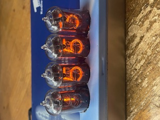

# Retro Nixi-clock PI PICO — READMY.md

<!-- Bilder: Lege die Dateien in docs/images/ ab und passe ggf. die Dateinamen an -->
<p align="center">
  
</p>

## Deutsch (DE)

### Überblick
**Retro Clock Nixi-clock** ist eine MicroPython-Uhr mit einem 4‑Bit-Datenbus (Pins 10–13) und vier Latch‑Leitungen (Pins 6–9) zum Ansteuern von vier Ziffern. Eine **TinyRTC (DS1307)** liefert die Zeit (24h), zwei Taster stellen **Stunden (HH)** und **Minuten (MM)**. Kurzer Tastendruck erhöht um **+1**, langes Halten (≈600 ms) wiederholt die Erhöhung im **200 ms‑Takt**. Minuten laufen **nicht** in Stunden über; beim Stellen werden **Sekunden auf 0** gesetzt.

### Funktionen
- `set_port(value[, digit])` – gibt einen 4‑Bit‑Wert (0..15) über Pins **10..13** aus; optional wird **digit 0..3** (Latch‑Pins **6..9**) gepulst.
- `get_port()` – liefert den zuletzt ausgegebenen 4‑Bit‑Wert.
- `set_wert(wert)` – zeigt eine Zahl **0..9999** als vier Dezimalziffern (digit0=Einer … digit3=Tausender).
- `show_hhmm(hh, mm)` – zeigt die Zeit **hh:mm** (ohne Doppelpunktsteuerung).
- `rtc_init(scl_pin, sda_pin[, freq, i2c_id])` – initialisiert I²C und DS1307.
- `rtc_get()` / `rtc_set(hh, mm)` – Zeit lesen bzw. setzen (Sekunden=0, kein Übertrag Minuten→Stunden).
- `scan_i2c([scl_pin, sda_pin, freq, i2c_id, verbose])` – scannt den I²C‑Bus.
- `clock_run(btn_hh_pin, btn_mm_pin, scl_pin, sda_pin[, long_press_ms, repeat_ms, refresh_ms])` – Endlosschleife: Uhr anzeigen und Tasten bedienen.
- `help()` – listet die verfügbaren Funktionen.

### Standard‑Pinbelegung
- **Datenpins:** 10, 11, 12, 13  
- **Latch‑Pins:** 6, 7, 8, 9  (digit 0..3)  
- **Buttons (Default):** HH=26, MM=27  
- **I²C (Default):** SCL=3, SDA=2, `i2c_id=1`, `freq=100 kHz`

> Passe die Pins bei Bedarf oben im Quelltext an.

### Verdrahtung & Hinweise
- **Taster:** gegen GND, Eingänge mit internem Pull‑Up (aktiv‑low).
- **TinyRTC / DS1307:** Viele Boards besitzen **5 V‑Pull‑Ups** auf SDA/SCL. Bei 3,3 V‑Controllern (PI PICO, ESP32) Level‑Shifter verwenden oder Pull‑Ups auf 3,3 V umbauen. DS1307 bevorzugt 5 V Versorgung.
- **Stromversorgung Display/Treiber:** Getrennte 5 V‑Quelle empfehlenswert; **GND gemeinsam**.

### Installation
1. `clock.py` auf das Board kopieren.  
2. Optional **Autostart**: `main.py` erstellen, die `clock.clock_run(...)` aufruft – oder `clock.py` direkt als `main.py` speichern.  
3. Serielle REPL öffnen, Test:
   ```python
   import clock
   clock.scan_i2c(scl_pin=5, sda_pin=4)      # Beispiel PI PICO
   clock.rtc_init(5, 4)
   clock.clock_run(btn_hh_pin=14, btn_mm_pin=15, scl_pin=5, sda_pin=4)
   ```

**ESP32‑Beispiel:**
```python
import clock
clock.clock_run(btn_hh_pin=26, btn_mm_pin=27, scl_pin=22, sda_pin=21)
```

### I²C‑Scan Beispiele
```python
clock.scan_i2c(5, 4)      # PI PICO: SCL=5, SDA=4
clock.scan_i2c(22, 21)    # ESP32:  SCL=22, SDA=21
```

### Fehlerbehebung
- **Keine Geräte beim I²C‑Scan:** Pull‑Ups prüfen; SCL/SDA vertauscht? Falsche `i2c_id`?  
- **Uhrzeit verstellt sich:** DS1307‑Batterie (CR2032) prüfen.  
- **Tasten „prellen“:** Werte `long_press_ms` / `repeat_ms` anpassen; Kabellängen minimieren.

---

## English (EN)

### Overview
**Retro Nixi-clock** is a MicroPython clock using a 4‑bit data bus (pins 10–13) and four latch lines (pins 6–9) to drive four digits. A **TinyRTC (DS1307)** keeps time (24h). Two buttons set **hours (HH)** and **minutes (MM)**. Short press adds **+1**; holding for ~**600 ms** auto‑repeats every **200 ms**. Minutes **do not** carry over to hours; when setting, **seconds reset to 0**.

### API
- `set_port(value[, digit])` – output 4‑bit value (0..15) on **pins 10..13**; optionally pulse **digit 0..3** (latch pins **6..9**).
- `get_port()` – return last 4‑bit value.
- `set_wert(value)` – display an integer **0..9999** across four digits (digit0=ones … digit3=thousands).
- `show_hhmm(hh, mm)` – display **hh:mm** (no colon control).
- `rtc_init(scl_pin, sda_pin[, freq, i2c_id])` – init I²C and DS1307.
- `rtc_get()` / `rtc_set(hh, mm)` – read / set time (seconds=0, no minute→hour carry).
- `scan_i2c([scl_pin, sda_pin, freq, i2c_id, verbose])` – scan I²C bus.
- `clock_run(btn_hh_pin, btn_mm_pin, scl_pin, sda_pin[, long_press_ms, repeat_ms, refresh_ms])` – main loop.
- `help()` – list available functions.

### Default Pins
- **Data pins:** 10, 11, 12, 13  
- **Latch pins:** 6, 7, 8, 9  (digit 0..3)  
- **Buttons (default):** HH=26, MM=27  
- **I²C (default):** SCL=3, SDA=2, `i2c_id=1`, `freq=100 kHz`

> Adjust pins at the top of the source as needed.

### Wiring & Notes
- **Buttons:** to GND, inputs use internal pull‑ups (active‑low).
- **TinyRTC / DS1307:** Many boards have **5 V pull‑ups** on SDA/SCL. With 3.3 V MCUs (PI PICO, ESP32) use a level shifter or replace pull‑ups with 3.3 V. DS1307 typically runs at 5 V.
- **Display/driver power:** Use a separate 5 V supply; **share GND**.

### Setup
1. Copy `clock.py` onto the board.  
2. Optional **autostart**: create `main.py` calling `clock.clock_run(...)` – or save `clock.py` as `main.py`.  
3. Open the serial REPL and test:
   ```python
   import clock
   clock.scan_i2c(scl_pin=5, sda_pin=4)      # PI PICO example
   clock.rtc_init(5, 4)
   clock.clock_run(btn_hh_pin=14, btn_mm_pin=15, scl_pin=5, sda_pin=4)
   ```

**ESP32 example:**
```python
import clock
clock.clock_run(btn_hh_pin=26, btn_mm_pin=27, scl_pin=22, sda_pin=21)
```

### I²C‑Scan examples
```python
clock.scan_i2c(5, 4)      # PI PICO: SCL=5, SDA=4
clock.scan_i2c(22, 21)    # ESP32:  SCL=22, SDA=21
```

### Troubleshooting
- **No devices on I²C scan:** Check pull‑ups; SCL/SDA swapped? Wrong `i2c_id`?  
- **Time drifts/resets:** Replace the DS1307 coin cell.  
- **Button bounce:** Tune `long_press_ms` / `repeat_ms`; shorten cables.

---

### Autostart
To start the clock on boot, either:
- Save `clock.py` as **`main.py`**, _or_
- Create a **`main.py`** that imports and calls `clock.clock_run(...)`.

### License
MIT (suggested) — adjust as you wish.
